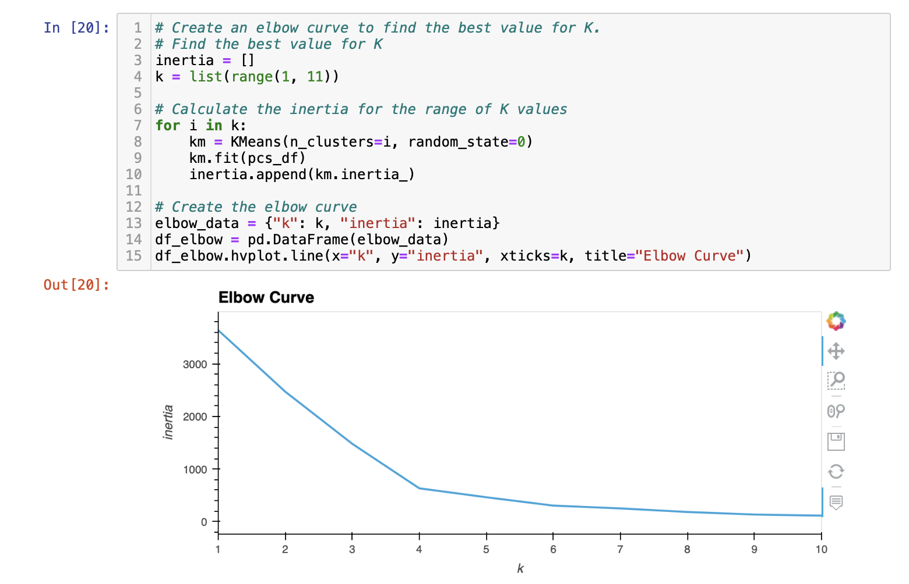
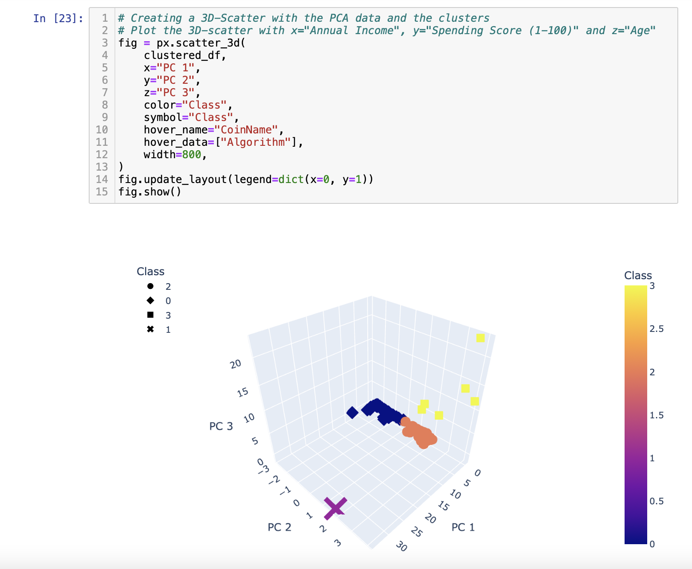
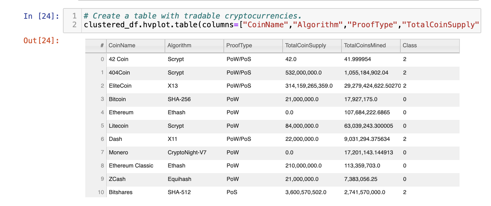
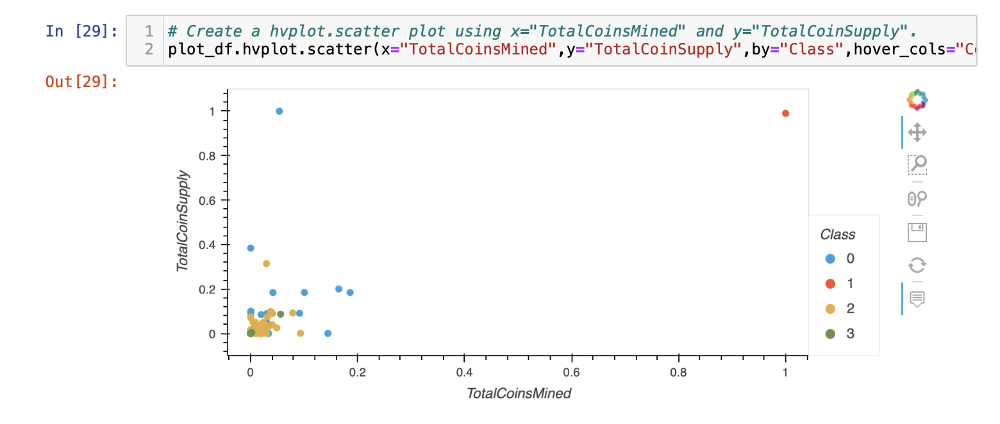

# Cryptocurrencies
Module 18 repository

This assignment consists of four technical analysis deliverables:

* Deliverable 1: Preprocessing the Data for PCA

* Deliverable 2: Reducing Data Dimensions Using PCA

* Deliverable 3: Clustering Cryptocurrencies Using K-means

* Deliverable 4: Visualizing Cryptocurrencies Results

The dataset (*crypto_data.csv*) used for this analysis was obtained from *CryptoCompare*.

## Additional Outputs

